# ThingsBoard Demo Plan – BTS Station Monitoring Platform

> **Telecom Network Operation Center (NOC) – Managing and Operating 10 BTS Stations**

---

## Table of Contents

1. [Business Context](#1-business-context)
2. [ThingsBoard Entity Model](#2-thingsboard-entity-model)
3. [ThingsBoard Component Configuration](#3-thingsboard-component-configuration)
4. [Asset Profiles](#4-asset-profiles)
5. [Device Profiles](#5-device-profiles)
6. [Entity Relations](#6-entity-relations)
7. [Rule Chains](#7-rule-chains)
8. [Dashboard Design](#8-dashboard-design)
9. [Telemetry Simulation – MQTT Payloads](#9-telemetry-simulation--mqtt-payloads)
10. [Telemetry Simulator Script (Python)](#10-telemetry-simulator-script-python)
11. [RPC – Remote Procedure Call](#11-rpc--remote-procedure-call)
12. [OTA Firmware Update](#12-ota-firmware-update)
13. [ThingsBoard Edge](#13-thingsboard-edge)
14. [API Integration](#14-api-integration)
15. [Security Configuration](#15-security-configuration)
16. [Data Retention and Storage](#16-data-retention-and-storage)
17. [Audit Log](#17-audit-log)
18. [Device Provisioning](#18-device-provisioning)
19. [Widget Types Summary](#19-widget-types-summary)
20. [Demo Scenarios](#20-demo-scenarios)
21. [Station Details](#21-station-details--10-bts-stations)
22. [Scalability Plan](#22-scalability-plan)
23. [Platform Components Summary](#23-thingsboard-platform-components--summary)
24. [Project File Structure](#24-project-file-structure)

---

## 1. Business Context

### 1.1 Business Description

Telecom company **TelecomVN Corp** operates a network of **10 BTS (Base Transceiver Station) sites** distributed across **2 regions** (South and North), each region containing **multiple cities**. Every BTS station is equipped with industrial monitoring devices to track:

- **Power consumption** (Power Meter)
- **Equipment cabinet temperature** (Temperature Sensor)
- **Cabinet / equipment room door** (Door Sensor)
- **Environmental conditions** (Environment Sensor – humidity, air quality)
- **Backup generator** (Generator Monitor) — *at selected stations*

### 1.2 Stakeholders and Roles

| Role | Description | ThingsBoard Permission |
| :--- | :--- | :--- |
| **NOC Admin** | System administrator (nationwide) | Tenant Administrator |
| **Regional Manager** | Regional operations manager | Customer Administrator |
| **City Operator** | City-level operator | Customer User |
| **Field Engineer** | On-site maintenance technician | Customer User (read-only + ack alarm) |
| **Executive** | C-level / report viewer | Customer User (dashboard only) |

### 1.3 Operational KPIs

| KPI | Description | Threshold |
| :--- | :--- | :--- |
| Station Uptime | Continuous operation time | > 99.5% |
| Alarm Response Time | From alarm creation to acknowledgment | < 15 minutes |
| Cabinet Temperature | Keep within safe operating range | 18 °C – 40 °C |
| Voltage Stability | No fluctuation beyond safe margin | 200 V – 240 V |
| Monthly Power Usage | Track operational cost | Monthly report |

---

## 2. ThingsBoard Entity Model

### 2.1 Entity Hierarchy

```text
TelecomVN Corp (Tenant)
   |
   +-- South Region (Asset - Region Profile)
   |       |
   |       +-- Ho Chi Minh City (Asset - City Profile)
   |       |       |
   |       |       +-- BTS-HCM-001 (Asset - BTS Station Profile)
   |       |       |       +-- PM-HCM-001  (Device - Power Meter Profile)
   |       |       |       +-- TS-HCM-001  (Device - Temperature Sensor Profile)
   |       |       |       +-- DS-HCM-001  (Device - Door Sensor Profile)
   |       |       |       +-- ES-HCM-001  (Device - Environment Sensor Profile)
   |       |       |
   |       |       +-- BTS-HCM-002 (Asset - BTS Station Profile)
   |       |       |       +-- PM-HCM-002  (Device - Power Meter Profile)
   |       |       |       +-- TS-HCM-002  (Device - Temperature Sensor Profile)
   |       |       |       +-- DS-HCM-002  (Device - Door Sensor Profile)
   |       |       |
   |       |       +-- BTS-HCM-003 (Asset - BTS Station Profile)
   |       |               +-- PM-HCM-003  (Device - Power Meter Profile)
   |       |               +-- TS-HCM-003  (Device - Temperature Sensor Profile)
   |       |               +-- DS-HCM-003  (Device - Door Sensor Profile)
   |       |               +-- GE-HCM-003  (Device - Generator Profile)
   |       |
   |       +-- Can Tho (Asset - City Profile)
   |               |
   |               +-- BTS-CT-001 (Asset - BTS Station Profile)
   |               |       +-- PM-CT-001
   |               |       +-- TS-CT-001
   |               |       +-- DS-CT-001
   |               |
   |               +-- BTS-CT-002 (Asset - BTS Station Profile)
   |                       +-- PM-CT-002
   |                       +-- TS-CT-002
   |                       +-- DS-CT-002
   |                       +-- ES-CT-002
   |
   +-- North Region (Asset - Region Profile)
           |
           +-- Ha Noi (Asset - City Profile)
           |       |
           |       +-- BTS-HN-001 (Asset - BTS Station Profile)
           |       |       +-- PM-HN-001
           |       |       +-- TS-HN-001
           |       |       +-- DS-HN-001
           |       |       +-- ES-HN-001
           |       |
           |       +-- BTS-HN-002 (Asset - BTS Station Profile)
           |       |       +-- PM-HN-002
           |       |       +-- TS-HN-002
           |       |       +-- DS-HN-002
           |       |
           |       +-- BTS-HN-003 (Asset - BTS Station Profile)
           |               +-- PM-HN-003
           |               +-- TS-HN-003
           |               +-- DS-HN-003
           |               +-- GE-HN-003
           |
           +-- Hai Phong (Asset - City Profile)
                   |
                   +-- BTS-HP-001 (Asset - BTS Station Profile)
                           +-- PM-HP-001
                           +-- TS-HP-001
                           +-- DS-HP-001
```

### 2.2 Device Inventory

| BTS Station | Power Meter | Temp Sensor | Door Sensor | Env Sensor | Generator | Total |
| :--- | :---: | :---: | :---: | :---: | :---: | :---: |
| BTS-HCM-001 | 1 | 1 | 1 | 1 | — | 4 |
| BTS-HCM-002 | 1 | 1 | 1 | — | — | 3 |
| BTS-HCM-003 | 1 | 1 | 1 | — | 1 | 4 |
| BTS-CT-001 | 1 | 1 | 1 | — | — | 3 |
| BTS-CT-002 | 1 | 1 | 1 | 1 | — | 4 |
| BTS-HN-001 | 1 | 1 | 1 | 1 | — | 4 |
| BTS-HN-002 | 1 | 1 | 1 | — | — | 3 |
| BTS-HN-003 | 1 | 1 | 1 | — | 1 | 4 |
| BTS-HP-001 | 1 | 1 | 1 | — | — | 3 |
| **Total** | **10** | **10** | **10** | **3** | **2** | **35** |

---

## 3. ThingsBoard Component Configuration

### 3.1 Tenant

| Property | Value |
| :--- | :--- |
| **Tenant Name** | TelecomVN Corp |
| **Description** | Telecom BTS Monitoring Platform |
| **Email** | admin@telecomvn.vn |

### 3.2 Customers (Multi-tenancy / Regional Data Isolation)

ThingsBoard **Customer** entities are used to isolate data access by region:

| Customer Name | Description | Assigned Assets |
| :--- | :--- | :--- |
| Region-South | Manages southern region | South Region, HCM, CT + all child BTS |
| Region-North | Manages northern region | North Region, HN, HP + all child BTS |

> **Note:** "Customer" in ThingsBoard is **not** a business customer. It is a data-isolation mechanism that controls access to entities.

### 3.3 Customer Users

| User | Customer | Role |
| :--- | :--- | :--- |
| south\_manager@telecomvn.vn | Region-South | Customer Administrator |
| north\_manager@telecomvn.vn | Region-North | Customer Administrator |
| operator\_hcm@telecomvn.vn | Region-South | Customer User |
| operator\_hn@telecomvn.vn | Region-North | Customer User |
| field\_01@telecomvn.vn | Region-South | Customer User |
| field\_02@telecomvn.vn | Region-North | Customer User |

---

## 4. Asset Profiles

### 4.1 Region Profile

```yaml
Profile Name: Region Profile
Description:  Represents a geographic region (South / North / Central)
Default Rule Chain: Root Rule Chain
Default Dashboard:  Region Overview Dashboard

Server Attributes:
  - region_code    : String     # "SOUTH", "NORTH"
  - region_name    : String     # "South Region"
  - manager_name   : String
  - manager_phone  : String
  - total_stations : Integer
```

### 4.2 City Profile

```yaml
Profile Name: City Profile
Description:  Represents a city within a region
Default Rule Chain: Root Rule Chain
Default Dashboard:  City Overview Dashboard

Server Attributes:
  - city_code      : String     # "HCM", "HN", "CT", "HP"
  - city_name      : String     # "Ho Chi Minh City"
  - province       : String
  - total_stations : Integer
  - contact_phone  : String
```

### 4.3 BTS Station Profile (Core Asset)

```yaml
Profile Name: BTS Station Profile
Description:  BTS base transceiver station - primary operational unit
Default Rule Chain: BTS Alarm Rule Chain
Default Dashboard:  BTS Station Detail Dashboard

Server Attributes:
  - station_id        : String    # "BTS-HCM-001"
  - station_name      : String    # "District 1 - Nguyen Hue"
  - address           : String
  - latitude          : Double    # 10.7769
  - longitude         : Double    # 106.7009
  - tower_height      : Double    # 35.0 (meters)
  - tower_type        : String    # "Monopole" | "Lattice" | "Guyed"
  - installation_date : String    # "2023-01-15"
  - operator          : String    # "TelecomVN"
  - site_type         : String    # "Indoor" | "Outdoor" | "Rooftop"
  - power_source      : String    # "Grid" | "Grid+Generator" | "Solar"
  - has_generator     : Boolean
  - maintenance_cycle : Integer   # days (90)
  - last_maintenance  : String    # "2025-12-01"
  - next_maintenance  : String    # "2026-03-01"
  - status            : String    # "Active" | "Maintenance" | "Decommissioned"
  - contract_id       : String
  - sla_level         : String    # "Gold" | "Silver" | "Bronze"

Alarm Rules (Asset-level):
  ALL_DEVICES_OFFLINE:
    condition: "All child devices inactive > 10 min"
    severity:  CRITICAL
    action:    Notify NOC + SMS
```

---

## 5. Device Profiles

### 5.1 Power Meter Profile

```yaml
Profile Name:   Power Meter Profile
Transport Type: MQTT
Description:    Electrical power meter installed at BTS station

Telemetry Keys:
  - voltage      : Double (V)       # Grid voltage
  - current      : Double (A)       # Load current
  - power        : Double (kW)      # Active power
  - energy       : Double (kWh)     # Cumulative energy
  - frequency    : Double (Hz)      # Grid frequency
  - power_factor : Double           # Power factor (0-1)

Server Attributes:
  - model            : String   # "Eastron SDM630"
  - serial_number    : String
  - firmware_version : String
  - max_voltage      : Double   # 250
  - max_current      : Double   # 100
  - install_date     : String
  - calibration_date : String

Alarm Rules:
  HIGH_VOLTAGE:
    condition: voltage > 240
    severity:  WARNING
    detail:    "Abnormally high voltage: ${voltage} V"

  LOW_VOLTAGE:
    condition: voltage < 200
    severity:  CRITICAL
    detail:    "Dangerously low voltage: ${voltage} V - Power loss risk"

  POWER_LOSS:
    condition: voltage == 0 AND duration > 60s
    severity:  CRITICAL
    detail:    "POWER OUTAGE at station - Voltage = 0 V"

  HIGH_POWER_CONSUMPTION:
    condition: power > 5.0
    severity:  WARNING
    detail:    "Abnormal power consumption: ${power} kW"

  DEVICE_INACTIVE:
    condition: no telemetry > 300s
    severity:  MAJOR
    detail:    "Power Meter disconnected > 5 minutes"

Provisioning:
  type: CHECK_PRE_PROVISIONED_DEVICES
  key:  provision_key_pm
```

### 5.2 Temperature Sensor Profile

```yaml
Profile Name:   Temperature Sensor Profile
Transport Type: MQTT
Description:    Cabinet temperature sensor at BTS station

Telemetry Keys:
  - temperature : Double (deg C)

Server Attributes:
  - model               : String   # "DS18B20" / "SHT31"
  - serial_number       : String
  - firmware_version    : String
  - location_in_station : String   # "Cabinet A" / "Cabinet B"
  - min_range           : Double   # -40
  - max_range           : Double   # 125

Alarm Rules:
  HIGH_TEMPERATURE:
    condition: temperature > 40
    severity:  CRITICAL
    detail:    "Cabinet temperature HIGH: ${temperature} C - Hardware damage risk"

  WARNING_TEMPERATURE:
    condition: temperature > 35 AND temperature <= 40
    severity:  WARNING
    detail:    "Cabinet temperature rising: ${temperature} C"

  LOW_TEMPERATURE:
    condition: temperature < 5
    severity:  WARNING
    detail:    "Temperature too low: ${temperature} C"

  DEVICE_INACTIVE:
    condition: no telemetry > 300s
    severity:  MAJOR
```

### 5.3 Door Sensor Profile

```yaml
Profile Name:   Door Sensor Profile
Transport Type: MQTT
Description:    Cabinet / equipment room door sensor at BTS station

Telemetry Keys:
  - door_state : Boolean    # true = Open, false = Closed
  - open_count : Integer    # Number of open events per day

Server Attributes:
  - model            : String
  - serial_number    : String
  - door_location    : String   # "Main Door" | "Cabinet A" | "Cabinet B"
  - firmware_version : String

Alarm Rules:
  DOOR_OPEN_LONG:
    condition: door_state == true AND duration > 600s
    severity:  WARNING
    detail:    "Door open longer than 10 minutes - Check security"

  DOOR_OPEN_NIGHT:
    condition: door_state == true AND time_between(22:00, 06:00)
    severity:  CRITICAL
    detail:    "ALERT: Door opened outside working hours"

  FREQUENT_OPEN:
    condition: open_count > 20 in 1 hour
    severity:  WARNING
    detail:    "Abnormal door activity: ${open_count} open events"

  DEVICE_INACTIVE:
    condition: no telemetry > 600s
    severity:  MAJOR
```

### 5.4 Environment Sensor Profile

```yaml
Profile Name:   Environment Sensor Profile
Transport Type: MQTT
Description:    Environmental sensor (humidity, air quality)

Telemetry Keys:
  - humidity    : Double  (%)
  - air_quality : Integer (AQI index)
  - pressure    : Double  (hPa)

Server Attributes:
  - model            : String   # "BME680"
  - serial_number    : String
  - firmware_version : String

Alarm Rules:
  HIGH_HUMIDITY:
    condition: humidity > 80
    severity:  WARNING
    detail:    "High humidity: ${humidity}% - Condensation risk"

  LOW_HUMIDITY:
    condition: humidity < 20
    severity:  WARNING
    detail:    "Humidity too low: ${humidity}%"

  POOR_AIR_QUALITY:
    condition: air_quality > 150
    severity:  WARNING
    detail:    "Poor air quality: AQI = ${air_quality}"

  DEVICE_INACTIVE:
    condition: no telemetry > 600s
    severity:  MAJOR
```

### 5.5 Generator Monitor Profile

```yaml
Profile Name:   Generator Monitor Profile
Transport Type: MQTT
Description:    Backup diesel generator monitor

Telemetry Keys:
  - gen_status      : String  # "OFF" | "RUNNING" | "STANDBY" | "ERROR"
  - gen_voltage     : Double  (V)
  - gen_fuel_level  : Double  (%)
  - gen_runtime     : Double  (hours)
  - gen_temperature : Double  (deg C)

Server Attributes:
  - model         : String   # "Cummins C150D5"
  - serial_number : String
  - fuel_capacity : Double   # liters
  - max_power     : Double   # kW

Alarm Rules:
  LOW_FUEL:
    condition: gen_fuel_level < 20
    severity:  CRITICAL
    detail:    "Generator fuel level low: ${gen_fuel_level}%"

  GENERATOR_ERROR:
    condition: gen_status == "ERROR"
    severity:  CRITICAL
    detail:    "Generator reporting error state"

  GENERATOR_OVERHEAT:
    condition: gen_temperature > 95
    severity:  CRITICAL
    detail:    "Generator overheating: ${gen_temperature} C"

  DEVICE_INACTIVE:
    condition: no telemetry > 300s
    severity:  MAJOR
```

---

## 6. Entity Relations

### 6.1 Relation Types

| From Entity | Relation Type | To Entity | Direction |
| :--- | :---: | :--- | :---: |
| Region | **Contains** | City | FROM |
| City | **Contains** | BTS Station | FROM |
| BTS Station | **Contains** | Device (all types) | FROM |
| BTS Station | **Manages** | Generator | FROM |
| Field Engineer (User) | **AssignedTo** | BTS Station | FROM |

### 6.2 Relation Diagram

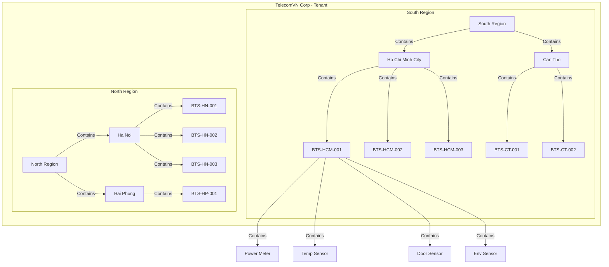

---

## 7. Rule Chains

### 7.1 Root Rule Chain

All incoming messages flow through the Root Rule Chain first:

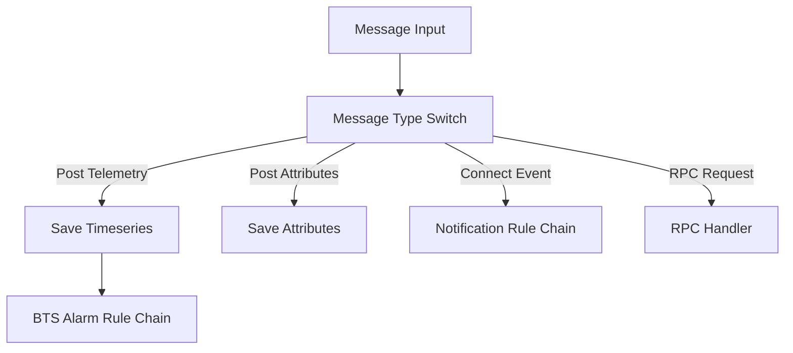

### 7.2 BTS Alarm Rule Chain

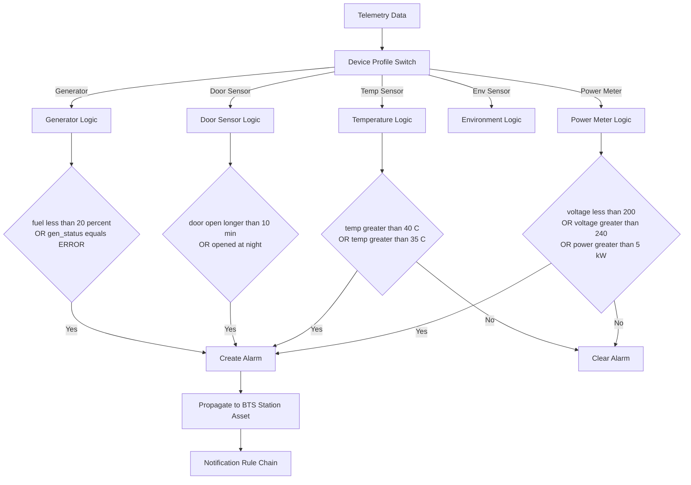

### 7.3 Notification Rule Chain

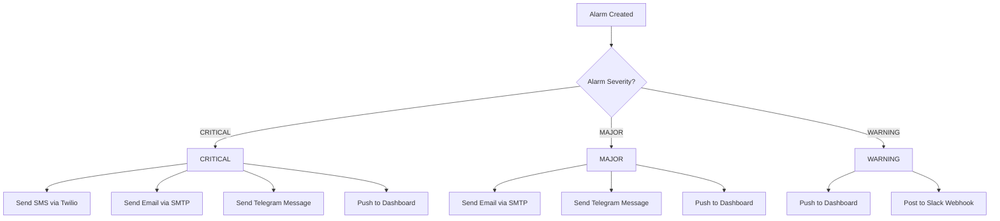

### 7.4 Data Aggregation Rule Chain

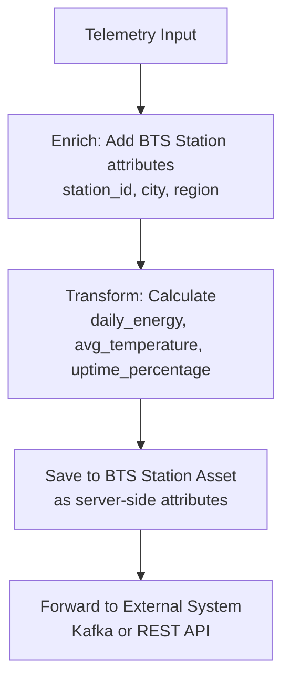

---

## 8. Dashboard Design

### 8.1 NOC Overview Dashboard (Nationwide)

**Audience:** NOC Admin, Executive

```text
+---------------------------------------------------------------+
|  NOC OVERVIEW - TelecomVN BTS Monitoring                      |
+---------------------------------------------------------------+
|                                                               |
|  +-----------------------------------------------------------+
|  |  GEOGRAPHIC MAP (OpenStreetMap)                            |
|  |                                                            |
|  |  [green pin] BTS-HCM-001    [green pin] BTS-HCM-002       |
|  |  [red pin]   BTS-HN-003     [green pin] ...               |
|  |                                                            |
|  |  Color:  Green = OK  |  Yellow = Warning  |  Red = Critical|
|  +-----------------------------------------------------------+
|                                                               |
|  +-----------+  +-----------+  +-----------+  +-----------+   |
|  | Total     |  | Active    |  | Active    |  | Offline   |   |
|  | Stations  |  | Devices   |  | Alarms    |  | Devices   |   |
|  |    10     |  |    33     |  |     2     |  |     2     |   |
|  | Value Card|  | Value Card|  | Value Card|  | Value Card|   |
|  +-----------+  +-----------+  +-----------+  +-----------+   |
|                                                               |
|  +-------------------------+  +---------------------------+   |
|  | ALARM TABLE             |  | POWER CONSUMPTION         |   |
|  |                         |  | (Bar Chart)               |   |
|  | Station    | Severity   |  |                           |   |
|  | HN-003     | CRITICAL   |  | [====] HCM-001:  2.3 kW  |   |
|  | HCM-002    | WARNING    |  | [======] HCM-002: 3.1 kW |   |
|  |                         |  | [====] HN-001:   2.1 kW  |   |
|  +-------------------------+  +---------------------------+   |
|                                                               |
|  +-----------------------------------------------------------+
|  | STATION STATUS TABLE                                       |
|  |                                                            |
|  | Station      | City | Voltage | Temp  | Door | SLA       |
|  | BTS-HCM-001  | HCM  | 221 V   | 28 C  | OK   | Gold     |
|  | BTS-HN-003   | HN   |   0 V   |  --   | WARN | Gold     |
|  +-----------------------------------------------------------+
+---------------------------------------------------------------+
```

**Widgets used:**

| Widget | Type | Purpose |
| :--- | :--- | :--- |
| OpenStreetMap | Maps | All BTS stations with color-coded markers |
| Value Card (x4) | Cards | Total stations, active devices, alarms, offline count |
| Alarm Table | Tables | Active alarms sorted by severity |
| Bar Chart | Charts | Power consumption comparison across stations |
| Entity Table | Tables | Station status overview with latest telemetry |

### 8.2 BTS Station Detail Dashboard

**Audience:** City Operator, Field Engineer

```text
+---------------------------------------------------------------+
|  BTS STATION DETAIL - ${station_name}                         |
|  Entity: BTS-HCM-001  |  Status: Active  |  SLA: Gold        |
+---------------------------------------------------------------+
|                                                               |
|  +-------------+  +-------------+  +---------------------+   |
|  | VOLTAGE     |  | TEMPERATURE |  | DOOR STATUS         |   |
|  |   221 V     |  |   28.5 C    |  |   CLOSED            |   |
|  | Analog Gauge|  | Radial Gauge|  | Status Widget       |   |
|  +-------------+  +-------------+  +---------------------+   |
|                                                               |
|  +-----------------------------------------------------------+
|  | POWER CONSUMPTION - Last 24 Hours                          |
|  | Timeseries Line Chart (voltage, current, power, energy)    |
|  +-----------------------------------------------------------+
|                                                               |
|  +-------------------------+  +---------------------------+   |
|  | TEMPERATURE - 24h       |  | HUMIDITY - 24h            |   |
|  | Line Chart              |  | Line Chart                |   |
|  +-------------------------+  +---------------------------+   |
|                                                               |
|  +-----------------------------------------------------------+
|  | DEVICE STATUS TABLE                                        |
|  |                                                            |
|  | Device      | Type         | Status  | Last Seen          |
|  | PM-HCM-001  | Power Meter  | Online  | 2s ago             |
|  | TS-HCM-001  | Temp Sensor  | Online  | 5s ago             |
|  | DS-HCM-001  | Door Sensor  | Online  | 3s ago             |
|  +-----------------------------------------------------------+
|                                                               |
|  +-----------------------------------------------------------+
|  | ALARM HISTORY - This Station                               |
|  |                                                            |
|  | Created   | Type           | Severity  | Status            |
|  | 10:23 AM  | HIGH_TEMP      | CRITICAL  | Active            |
|  | 09:15 AM  | DOOR_OPEN_LONG | WARNING   | Cleared           |
|  +-----------------------------------------------------------+
|                                                               |
|  +-----------------------------------------------------------+
|  | RPC CONTROLS                                               |
|  |                                                            |
|  | [Restart Sensor]  [Request Data]                           |
|  | [Test Alarm]      [Update Config]                          |
|  +-----------------------------------------------------------+
+---------------------------------------------------------------+
```

**Widgets used:**

| Widget | Type | Purpose |
| :--- | :--- | :--- |
| Analog Gauge | Gauge | Real-time voltage display |
| Radial Gauge | Gauge | Temperature with colored zones (green/yellow/red) |
| Status Widget | Status | Door open/closed boolean indicator |
| Timeseries Line Chart | Charts | Power, temperature, humidity trends |
| Entity Table | Tables | Device list with connectivity status |
| Alarm Table | Tables | Station-specific alarm history |
| RPC Button (x4) | Input | Remote control actions |

### 8.3 Regional Report Dashboard

**Audience:** Regional Manager, Executive

```text
+---------------------------------------------------------------+
|  REGIONAL REPORT - ${region_name}                             |
+---------------------------------------------------------------+
|                                                               |
|  +-----------------------------------------------------------+
|  | MONTHLY POWER CONSUMPTION BY STATION                       |
|  | Stacked Bar Chart                                          |
|  +-----------------------------------------------------------+
|                                                               |
|  +-----------+  +-----------+  +-----------+                  |
|  | CRITICAL  |  | MAJOR     |  | WARNING   |                  |
|  |     3     |  |     7     |  |    15     |                  |
|  +-----------+  +-----------+  +-----------+                  |
|                                                               |
|  | Pie Chart: Alarms by Type                                  |
|                                                               |
|  +-----------------------------------------------------------+
|  | UPTIME REPORT - Last 30 Days                               |
|  |                                                            |
|  | Station      | Uptime  | Downtime | SLA Met               |
|  | BTS-HCM-001  | 99.8%   | 1.4h     | Yes                   |
|  | BTS-HCM-003  | 98.2%   | 12.9h    | No                    |
|  +-----------------------------------------------------------+
+---------------------------------------------------------------+
```

### 8.4 Generator Monitoring Dashboard

```text
+---------------------------------------------------------------+
|  GENERATOR MONITORING                                         |
+---------------------------------------------------------------+
|                                                               |
|  +-------------+  +--------------+  +-------------+          |
|  | STATUS      |  | FUEL LEVEL   |  | RUNTIME     |          |
|  | RUNNING     |  |    45%       |  |  123.5 h    |          |
|  | LED Widget  |  | Level Gauge  |  | Value Card  |          |
|  +-------------+  +--------------+  +-------------+          |
|                                                               |
|  +-----------------------------------------------------------+
|  | GENERATOR RUNTIME LOG - Last 7 Days                        |
|  | Timeseries Table                                           |
|  +-----------------------------------------------------------+
+---------------------------------------------------------------+
```

---

## 9. Telemetry Simulation – MQTT Payloads

### 9.1 Power Meter

**Topic:** `v1/devices/me/telemetry`
**Token:** `PM-HCM-001-TOKEN`
**Interval:** Every 10 seconds

```json
{
  "ts": 1709640000000,
  "values": {
    "voltage": 221.3,
    "current": 4.8,
    "power": 1.062,
    "energy": 15234.5,
    "frequency": 50.02,
    "power_factor": 0.98
  }
}
```

### 9.2 Temperature Sensor

**Topic:** `v1/devices/me/telemetry`
**Token:** `TS-HCM-001-TOKEN`
**Interval:** Every 30 seconds

```json
{
  "ts": 1709640000000,
  "values": {
    "temperature": 28.5
  }
}
```

### 9.3 Door Sensor

**Topic:** `v1/devices/me/telemetry`
**Token:** `DS-HCM-001-TOKEN`
**Interval:** On event

```json
{
  "ts": 1709640000000,
  "values": {
    "door_state": true,
    "open_count": 5
  }
}
```

### 9.4 Environment Sensor

**Topic:** `v1/devices/me/telemetry`
**Token:** `ES-HCM-001-TOKEN`
**Interval:** Every 60 seconds

```json
{
  "ts": 1709640000000,
  "values": {
    "humidity": 62.5,
    "air_quality": 45,
    "pressure": 1013.2
  }
}
```

### 9.5 Generator Monitor

**Topic:** `v1/devices/me/telemetry`
**Token:** `GE-HCM-003-TOKEN`
**Interval:** Every 15 seconds (when running)

```json
{
  "ts": 1709640000000,
  "values": {
    "gen_status": "RUNNING",
    "gen_voltage": 219.8,
    "gen_fuel_level": 72.3,
    "gen_runtime": 45.2,
    "gen_temperature": 78.5
  }
}
```

---

## 10. Telemetry Simulator Script (Python)

```python
#!/usr/bin/env python3
"""
BTS Station Telemetry Simulator
Simulates 10 BTS stations with 35 devices sending MQTT data to ThingsBoard.
"""

import paho.mqtt.client as mqtt
import json
import time
import random
import threading
from datetime import datetime

# --- ThingsBoard MQTT Configuration ---
TB_HOST = "localhost"
TB_PORT = 1883

# --- Device Registry (token configured in ThingsBoard) ---
DEVICES = {
    # Ho Chi Minh City
    "PM-HCM-001": {"token": "PM_HCM_001_TOKEN", "type": "power_meter"},
    "TS-HCM-001": {"token": "TS_HCM_001_TOKEN", "type": "temp_sensor"},
    "DS-HCM-001": {"token": "DS_HCM_001_TOKEN", "type": "door_sensor"},
    "ES-HCM-001": {"token": "ES_HCM_001_TOKEN", "type": "env_sensor"},
    "PM-HCM-002": {"token": "PM_HCM_002_TOKEN", "type": "power_meter"},
    "TS-HCM-002": {"token": "TS_HCM_002_TOKEN", "type": "temp_sensor"},
    "DS-HCM-002": {"token": "DS_HCM_002_TOKEN", "type": "door_sensor"},
    "PM-HCM-003": {"token": "PM_HCM_003_TOKEN", "type": "power_meter"},
    "TS-HCM-003": {"token": "TS_HCM_003_TOKEN", "type": "temp_sensor"},
    "DS-HCM-003": {"token": "DS_HCM_003_TOKEN", "type": "door_sensor"},
    "GE-HCM-003": {"token": "GE_HCM_003_TOKEN", "type": "generator"},
    # Can Tho
    "PM-CT-001":  {"token": "PM_CT_001_TOKEN",  "type": "power_meter"},
    "TS-CT-001":  {"token": "TS_CT_001_TOKEN",  "type": "temp_sensor"},
    "DS-CT-001":  {"token": "DS_CT_001_TOKEN",  "type": "door_sensor"},
    "PM-CT-002":  {"token": "PM_CT_002_TOKEN",  "type": "power_meter"},
    "TS-CT-002":  {"token": "TS_CT_002_TOKEN",  "type": "temp_sensor"},
    "DS-CT-002":  {"token": "DS_CT_002_TOKEN",  "type": "door_sensor"},
    "ES-CT-002":  {"token": "ES_CT_002_TOKEN",  "type": "env_sensor"},
    # Ha Noi
    "PM-HN-001":  {"token": "PM_HN_001_TOKEN",  "type": "power_meter"},
    "TS-HN-001":  {"token": "TS_HN_001_TOKEN",  "type": "temp_sensor"},
    "DS-HN-001":  {"token": "DS_HN_001_TOKEN",  "type": "door_sensor"},
    "ES-HN-001":  {"token": "ES_HN_001_TOKEN",  "type": "env_sensor"},
    "PM-HN-002":  {"token": "PM_HN_002_TOKEN",  "type": "power_meter"},
    "TS-HN-002":  {"token": "TS_HN_002_TOKEN",  "type": "temp_sensor"},
    "DS-HN-002":  {"token": "DS_HN_002_TOKEN",  "type": "door_sensor"},
    "PM-HN-003":  {"token": "PM_HN_003_TOKEN",  "type": "power_meter"},
    "TS-HN-003":  {"token": "TS_HN_003_TOKEN",  "type": "temp_sensor"},
    "DS-HN-003":  {"token": "DS_HN_003_TOKEN",  "type": "door_sensor"},
    "GE-HN-003":  {"token": "GE_HN_003_TOKEN",  "type": "generator"},
    # Hai Phong
    "PM-HP-001":  {"token": "PM_HP_001_TOKEN",  "type": "power_meter"},
    "TS-HP-001":  {"token": "TS_HP_001_TOKEN",  "type": "temp_sensor"},
    "DS-HP-001":  {"token": "DS_HP_001_TOKEN",  "type": "door_sensor"},
}


# --- Data Generators ---

def generate_power_meter_data():
    voltage = round(random.gauss(220, 5), 1)
    current = round(random.gauss(5, 1.5), 2)
    return {
        "voltage": voltage,
        "current": max(0, current),
        "power": round(voltage * max(0, current) / 1000, 3),
        "energy": round(random.uniform(10000, 50000), 1),
        "frequency": round(random.gauss(50, 0.1), 2),
        "power_factor": round(random.uniform(0.85, 0.99), 2),
    }


def generate_temp_data():
    return {"temperature": round(random.gauss(30, 5), 1)}


def generate_door_data():
    return {
        "door_state": random.random() < 0.05,   # 5% chance open
        "open_count": random.randint(0, 10),
    }


def generate_env_data():
    return {
        "humidity": round(random.gauss(65, 10), 1),
        "air_quality": random.randint(20, 100),
        "pressure": round(random.gauss(1013, 5), 1),
    }


def generate_generator_data():
    status = random.choice(["OFF", "OFF", "OFF", "STANDBY", "RUNNING"])
    return {
        "gen_status": status,
        "gen_voltage": round(random.gauss(220, 3), 1) if status == "RUNNING" else 0,
        "gen_fuel_level": round(random.uniform(20, 100), 1),
        "gen_runtime": round(random.uniform(0, 500), 1),
        "gen_temperature": round(random.gauss(75, 10), 1) if status == "RUNNING" else 25,
    }


# generator_function, interval_seconds
GENERATORS = {
    "power_meter": (generate_power_meter_data, 10),
    "temp_sensor": (generate_temp_data, 30),
    "door_sensor": (generate_door_data, 60),
    "env_sensor":  (generate_env_data, 60),
    "generator":   (generate_generator_data, 15),
}


# --- MQTT Sender ---

def send_telemetry(device_name, device_info):
    """Send telemetry for a single device in a loop."""
    token = device_info["token"]
    device_type = device_info["type"]
    generator_func, interval = GENERATORS[device_type]

    client = mqtt.Client()
    client.username_pw_set(token)

    try:
        client.connect(TB_HOST, TB_PORT, 60)
        client.loop_start()
        print(f"[OK] {device_name} connected")

        while True:
            data = generator_func()
            payload = json.dumps(data)
            client.publish("v1/devices/me/telemetry", payload)
            ts = datetime.now().strftime("%H:%M:%S")
            print(f"[{ts}] {device_name}: {payload}")
            time.sleep(interval)

    except Exception as e:
        print(f"[ERROR] {device_name}: {e}")


# --- Main ---

def main():
    print("=" * 60)
    print("  BTS Station Telemetry Simulator")
    print(f"  Devices : {len(DEVICES)}")
    print(f"  Server  : {TB_HOST}:{TB_PORT}")
    print("=" * 60)

    threads = []
    for name, info in DEVICES.items():
        t = threading.Thread(target=send_telemetry, args=(name, info), daemon=True)
        t.start()
        threads.append(t)
        time.sleep(0.1)  # stagger connections

    try:
        while True:
            time.sleep(1)
    except KeyboardInterrupt:
        print("\nSimulator stopped.")


if __name__ == "__main__":
    main()
```

---

## 11. RPC – Remote Procedure Call

### 11.1 Server-side RPC (Server to Device)

| Device Type | RPC Method | Params | Description |
| :--- | :--- | :--- | :--- |
| All | `getStatus` | — | Get current device status |
| All | `restartDevice` | — | Restart the sensor |
| Power Meter | `resetEnergy` | — | Reset cumulative energy counter |
| Power Meter | `setReportInterval` | `{"interval": 10}` | Change telemetry reporting interval |
| Door Sensor | `setAlarmMode` | `{"enabled": true}` | Enable / disable alarm mode |
| Generator | `startGenerator` | — | Start backup generator |
| Generator | `stopGenerator` | — | Stop backup generator |

### 11.2 Client-side RPC (Device to Server)

| RPC Method | Description |
| :--- | :--- |
| `requestConfig` | Device requests updated configuration from server |
| `reportError` | Device reports a hardware error |
| `requestFirmware` | Device requests OTA firmware check |

---

## 12. OTA Firmware Update

### 12.1 Firmware Package Configuration

```yaml
OTA Package:
  Title:          Temperature Sensor Firmware v2.1
  Version:        2.1.0
  Type:           FIRMWARE
  Device Profile: Temperature Sensor Profile
  File:           ts_firmware_v2.1.bin
  Checksum:       SHA256
```

### 12.2 OTA Update Flow

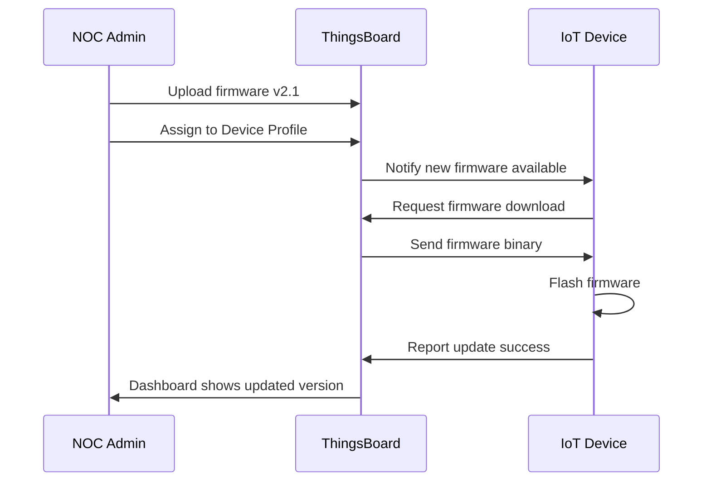

---

## 13. ThingsBoard Edge

### 13.1 Edge Architecture

Each BTS station can run a **ThingsBoard Edge** instance for local processing:

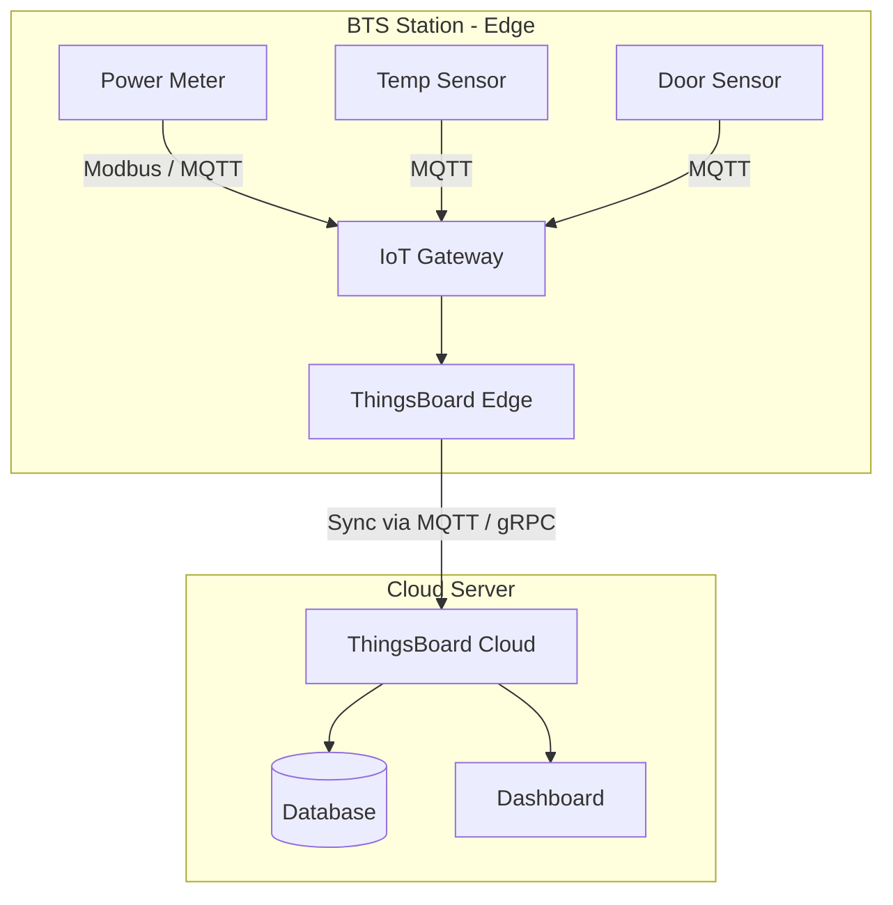

### 13.2 Edge Benefits for BTS Operations

| Feature | Description |
| :--- | :--- |
| **Offline operation** | Station continues processing locally when internet is down |
| **Local alarms** | Alarms are processed at the station without cloud dependency |
| **Data buffering** | Telemetry is buffered during outages and synced when online |
| **Bandwidth saving** | Only aggregated data is sent to the cloud |
| **Low latency** | Local rule chain processing under 10 ms |

---

## 14. API Integration

### 14.1 ThingsBoard REST API

| Endpoint | Method | Purpose |
| :--- | :---: | :--- |
| `/api/auth/login` | POST | Authenticate and obtain JWT token |
| `/api/tenant/devices` | GET | List all devices under tenant |
| `/api/device/{id}/credentials` | GET | Retrieve device access token |
| `/api/plugins/telemetry/{type}/{id}/values/timeseries` | GET | Query historical telemetry |
| `/api/alarm/{alarmId}/ack` | POST | Acknowledge an alarm |
| `/api/alarm/{alarmId}/clear` | POST | Clear an alarm |
| `/api/rpc/oneway/{deviceId}` | POST | Send one-way RPC command to device |
| `/api/device` | POST | Create a new device (provisioning) |
| `/api/relation` | POST | Create an entity relation |

### 14.2 External System Integration

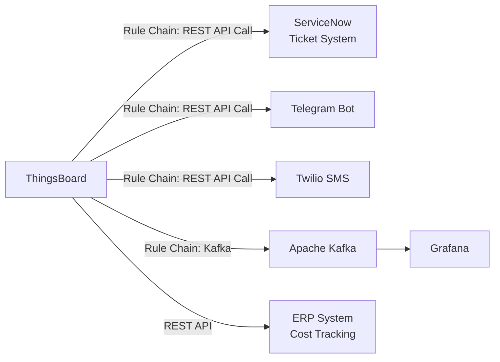

---

## 15. Security Configuration

### 15.1 Device Authentication Methods

| Method | Use Case | Description |
| :--- | :--- | :--- |
| **Access Token** | Demo / Development | Simple per-device token |
| **X.509 Certificate** | Production | Per-device certificate with mutual TLS |
| **MQTT Basic Auth** | Gateway | Username and password authentication |

### 15.2 Transport Security

```yaml
MQTT:
  Port 1883 : Non-TLS (development only)
  Port 8883 : MQTT over TLS (production)

HTTPS:
  Port 443  : Dashboard + REST API (TLS)

Certificates:
  CA          : Let's Encrypt / Internal CA
  Device Cert : Per-device X.509
```

### 15.3 Role-Based Access Control (RBAC)

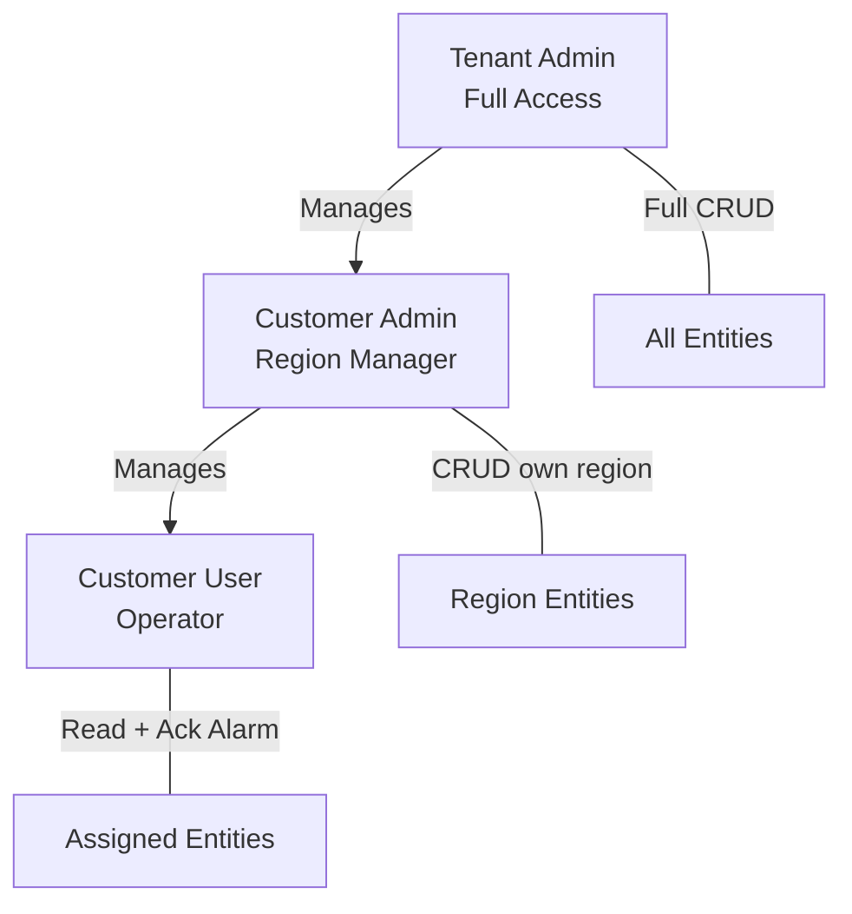

**Custom Roles (Professional Edition):**

| Role | Permissions |
| :--- | :--- |
| `NOC_ADMIN` | All operations across all entities |
| `REGION_MANAGER` | CRUD assets/devices in own region, manage alarms |
| `CITY_OPERATOR` | Read telemetry, acknowledge alarms, view dashboards |
| `FIELD_ENGINEER` | Read telemetry, acknowledge alarms, execute RPC |
| `EXECUTIVE` | View dashboards only (read-only) |

---

## 16. Data Retention and Storage

### 16.1 TTL (Time-to-Live) Configuration

```yaml
Timeseries Data:
  Raw data              : 90 days
  Aggregated (1 min avg): 1 year
  Aggregated (1 hr avg) : 3 years
  Aggregated (1 day avg): 5 years

Alarm Data:
  Active alarms  : Indefinite (until cleared)
  Cleared alarms : 2 years

Audit Logs:
  Retention : 1 year
```

### 16.2 Database Architecture

| Database | Purpose | Stores |
| :--- | :--- | :--- |
| **PostgreSQL** | Metadata | Tenants, Customers, Users, Devices, Assets, Relations, Profiles, Dashboards, Rule Chains, Alarms |
| **Cassandra / TimescaleDB** | Timeseries | `ts_kv` (raw telemetry), `ts_kv_latest` (latest values) |

---

## 17. Audit Log

ThingsBoard records all administrative actions:

| Event Type | Description |
| :--- | :--- |
| `LOGIN` | User logged in |
| `LOGOUT` | User logged out |
| `ADDED` | Entity created |
| `UPDATED` | Entity updated |
| `DELETED` | Entity deleted |
| `ALARM_ACK` | Alarm acknowledged |
| `ALARM_CLEAR` | Alarm cleared |
| `RPC_CALL` | RPC command sent to device |
| `CREDENTIALS_UPDATED` | Device token changed |
| `ASSIGNED_TO_CUSTOMER` | Entity assigned to customer |
| `RELATION_ADD` | Relation created between entities |

---

## 18. Device Provisioning

### 18.1 Automatic Provisioning Flow

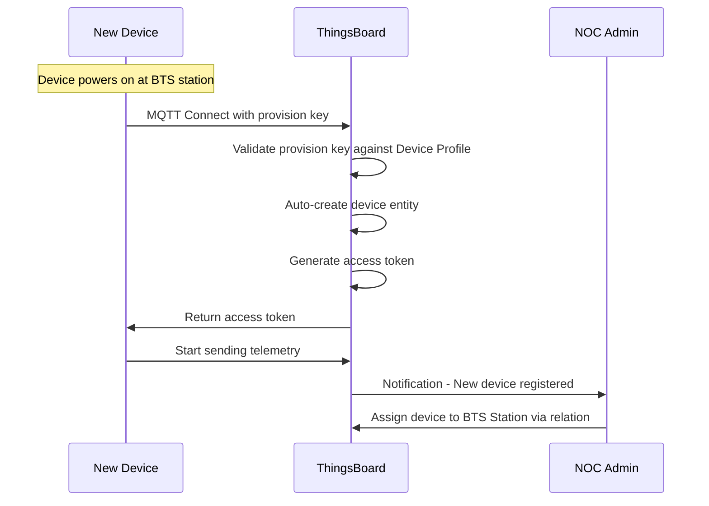

### 18.2 Bulk Provisioning (CSV Import)

```csv
name,type,label,profile,token,latitude,longitude,station
PM-HCM-001,Power Meter,Power Meter HCM-001,Power Meter Profile,PM_HCM_001_TOKEN,10.7769,106.7009,BTS-HCM-001
TS-HCM-001,Temp Sensor,Temp Sensor HCM-001,Temperature Sensor Profile,TS_HCM_001_TOKEN,10.7769,106.7009,BTS-HCM-001
DS-HCM-001,Door Sensor,Door Sensor HCM-001,Door Sensor Profile,DS_HCM_001_TOKEN,10.7769,106.7009,BTS-HCM-001
```

---

## 19. Widget Types Summary

| Category | Widget Name | Used For |
| :--- | :--- | :--- |
| **Maps** | OpenStreetMap | NOC map view showing all BTS stations |
| **Charts** | Timeseries Line Chart | Power, temperature, humidity trends |
| **Charts** | Timeseries Bar Chart | Power consumption comparison |
| **Charts** | Pie Chart | Alarm type distribution |
| **Charts** | Stacked Bar Chart | Monthly power report |
| **Gauges** | Analog Gauge | Real-time voltage display |
| **Gauges** | Radial Gauge | Temperature with colored zones |
| **Gauges** | Level Gauge | Generator fuel level |
| **Cards** | Value Card | Summary statistics |
| **Cards** | LED Indicator | Generator on/off status |
| **Tables** | Entity Table | Device list, station list |
| **Tables** | Alarm Table | Active and historical alarms |
| **Tables** | Timeseries Table | Exportable raw data |
| **Input** | RPC Button | Remote control actions |
| **Input** | Switch Control | ON/OFF toggle for devices |
| **Status** | Status Widget | Door open/closed indicator |
| **Navigation** | Entity Navigation | Drill-down: Region to City to BTS |
| **Static** | HTML Card | Station info display |
| **Static** | Markdown Card | Inline documentation |

---

## 20. Demo Scenarios

### Scenario 1: Normal Operation Monitoring

> **Goal:** Verify that all 10 BTS stations are online and reporting normally.

1. Login as **NOC Admin**.
2. Open the **NOC Overview Dashboard**.
3. Observe the map — all 10 BTS markers are **green**.
4. Value cards display: **10 stations**, **35 devices**, **0 alarms**.
5. Click **BTS-HCM-001** on the map.
6. Navigate to the **Station Detail Dashboard**.
7. Verify real-time gauges: Voltage 221 V, Temperature 28 °C, Door Closed.
8. Check the Entity Table — all devices show **Online**.

---

### Scenario 2: High Temperature Alarm

> **Goal:** Demonstrate the end-to-end alarm lifecycle.

1. Simulator sends `temperature = 42 °C` for **TS-HCM-001**.
2. BTS Alarm Rule Chain triggers — **CRITICAL** alarm created.
3. Notification Rule Chain fires:
   - SMS sent to field engineer
   - Telegram notification to NOC channel
   - Email sent to Regional Manager
4. Dashboard updates automatically:
   - **BTS-HCM-001** turns **red** on the map
   - Active alarm count changes from 0 to 1
   - Alarm Table shows: `HIGH_TEMPERATURE`, `CRITICAL`
5. Click the alarm to view detail: *"Cabinet temperature HIGH: 42 °C"*
6. Field Engineer **acknowledges** the alarm.
7. Issue fixed — temperature drops to 30 °C.
8. Rule Chain **auto-clears** the alarm.
9. **BTS-HCM-001** returns to **green** on the map.

---

### Scenario 3: Power Failure with Generator Failover

> **Goal:** Demonstrate grid power loss and backup generator activation.

1. Simulator sends `voltage = 0 V` for **PM-HCM-003**.
2. `POWER_LOSS` alarm triggered — **CRITICAL**.
3. Generator auto-starts: **GE-HCM-003** sends `gen_status = "RUNNING"`.
4. Dashboard shows:
   - BTS-HCM-003 grid power = **0 V**
   - Generator: **RUNNING**, fuel = **72%**
5. NOC Admin monitors dual indicators on Station Detail.
6. Grid power restored — `voltage = 220 V`.
7. Generator switches to **STANDBY**.
8. Alarm **auto-cleared**.

---

### Scenario 4: Security Alert – Door Open at Night

> **Goal:** Demonstrate after-hours physical security monitoring.

1. **DS-HN-001** sends `door_state = true` at **02:30 AM**.
2. `DOOR_OPEN_NIGHT` alarm triggered — **CRITICAL**.
3. SMS and Telegram notifications sent **immediately**.
4. NOC dispatches security team to the site.
5. Door closed — alarm cleared.
6. Audit log records the full event timeline.

---

### Scenario 5: Regional Performance Report

> **Goal:** Demonstrate management-level reporting.

1. Login as **Regional Manager (South)**.
2. Open the **Regional Report Dashboard**.
3. Review monthly power consumption by station (stacked bar chart).
4. Review alarm statistics (pie chart by alarm type).
5. Check uptime report — **BTS-HCM-003** SLA not met (98.2%).
6. Drill down to **BTS-HCM-003** to investigate root cause.
7. Export the report to PDF.

---

## 21. Station Details – 10 BTS Stations

| Station ID | City | Address | Latitude | Longitude | Tower Type | Devices | Generator |
| :--- | :--- | :--- | :---: | :---: | :--- | :---: | :---: |
| BTS-HCM-001 | Ho Chi Minh | District 1, Nguyen Hue | 10.7769 | 106.7009 | Monopole 35 m | 4 | No |
| BTS-HCM-002 | Ho Chi Minh | District 7, Phu My Hung | 10.7285 | 106.7178 | Rooftop 25 m | 3 | No |
| BTS-HCM-003 | Ho Chi Minh | District 9, Hi-Tech Park | 10.8556 | 106.7868 | Lattice 45 m | 4 | Yes |
| BTS-CT-001 | Can Tho | Ninh Kieu | 10.0341 | 105.7876 | Monopole 30 m | 3 | No |
| BTS-CT-002 | Can Tho | Binh Thuy | 10.0678 | 105.7417 | Guyed 40 m | 4 | No |
| BTS-HN-001 | Ha Noi | Hoan Kiem | 21.0285 | 105.8542 | Rooftop 20 m | 4 | No |
| BTS-HN-002 | Ha Noi | Cau Giay | 21.0313 | 105.7971 | Monopole 35 m | 3 | No |
| BTS-HN-003 | Ha Noi | Long Bien | 21.0453 | 105.8882 | Lattice 50 m | 4 | Yes |
| BTS-HP-001 | Hai Phong | Le Chan | 20.8449 | 106.6881 | Monopole 30 m | 3 | No |

> **Total: 10 stations, 35 devices** (10 Power Meters + 10 Temp Sensors + 10 Door Sensors + 3 Env Sensors + 2 Generators)

---

## 22. Scalability Plan

### Phase 1 – Demo (Current)

| Item | Value |
| :--- | :--- |
| Stations | 10 |
| Devices | 35 |
| Architecture | Single ThingsBoard server |
| Database | PostgreSQL |
| Transport | MQTT |

### Phase 2 – Pilot (50 stations)

| Item | Value |
| :--- | :--- |
| Stations | 50 |
| Devices | ~175 |
| Architecture | ThingsBoard PE (Professional Edition) |
| Database | PostgreSQL + TimescaleDB |
| Transport | MQTT + TLS |
| Edge | ThingsBoard Edge at selected stations |

### Phase 3 – Production (500 stations)

| Item | Value |
| :--- | :--- |
| Stations | 500 |
| Devices | ~1,750 |
| Architecture | ThingsBoard PE Cluster (3 nodes) |
| Database | PostgreSQL + Cassandra |
| Queue | Apache Kafka |
| Edge | ThingsBoard Edge at all stations |
| Deployment | Kubernetes |

### Phase 4 – Enterprise (5,000+ stations)

| Item | Value |
| :--- | :--- |
| Stations | 5,000+ |
| Devices | 17,500+ |
| Architecture | ThingsBoard PE Cluster (5+ nodes) |
| Queue | Kafka (3 brokers) |
| Database | Cassandra (5 nodes) + PostgreSQL HA |
| CDN | Dashboard content delivery |
| Deployment | Multi-region Kubernetes |

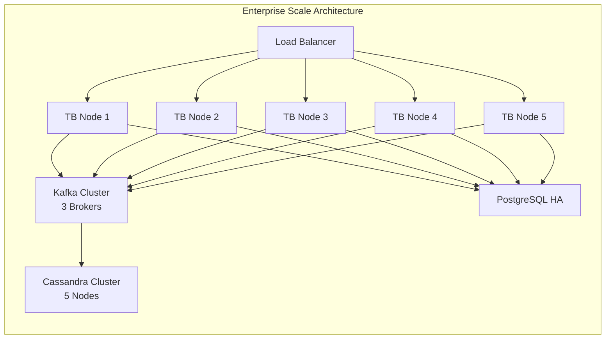

---

## 23. ThingsBoard Platform Components – Summary

| # | Component | Used | Details |
| :---: | :--- | :---: | :--- |
| 1 | **Tenant** | Yes | TelecomVN Corp |
| 2 | **Customer** | Yes | Region-South, Region-North |
| 3 | **User** | Yes | Admin, Manager, Operator, Engineer, Executive |
| 4 | **Asset Profile** | Yes | Region, City, BTS Station (3 profiles) |
| 5 | **Device Profile** | Yes | Power Meter, Temp, Door, Env, Generator (5 profiles) |
| 6 | **Asset** | Yes | 2 Regions + 4 Cities + 10 Stations = 16 assets |
| 7 | **Device** | Yes | 35 devices across 10 stations |
| 8 | **Relations** | Yes | Contains, Manages, AssignedTo |
| 9 | **Dashboards** | Yes | NOC Overview, Station Detail, Regional Report, Generator (4) |
| 10 | **Widgets** | Yes | 20+ widget types |
| 11 | **Rule Chains** | Yes | Root, BTS Alarm, Notification, Aggregation (4 chains) |
| 12 | **Alarms** | Yes | 15+ alarm types across all device profiles |
| 13 | **RPC** | Yes | Server-side + Client-side RPC |
| 14 | **OTA Update** | Yes | Firmware management per device profile |
| 15 | **Edge** | Yes | Local processing at BTS stations |
| 16 | **Provisioning** | Yes | Automatic + Bulk CSV provisioning |
| 17 | **MQTT Transport** | Yes | Primary device communication protocol |
| 18 | **REST API** | Yes | External system integration |
| 19 | **Security (TLS)** | Yes | MQTT TLS, HTTPS, X.509 certificates |
| 20 | **RBAC** | Yes | 5 custom roles |
| 21 | **Audit Log** | Yes | All administrative actions tracked |
| 22 | **Data TTL** | Yes | Retention policy configured per data type |
| 23 | **Scheduler** | Yes | Maintenance reminders and periodic tasks |
| 24 | **Notification Center** | Yes | SMS, Email, Telegram, Slack integration |

---

## 24. Project File Structure

```text
thingsboard-bts-demo/
|-- README.md
|-- docs/
|   +-- thingsboard_bts_demo_plan_en.md        <-- This document
|
|-- simulator/
|   |-- requirements.txt                        <-- paho-mqtt
|   +-- bts_simulator.py                        <-- Python MQTT simulator
|
|-- provisioning/
|   |-- devices.csv                             <-- Bulk device import
|   |-- assets.csv                              <-- Bulk asset import
|   +-- relations.csv                           <-- Bulk relation import
|
|-- dashboards/
|   |-- noc_overview.json                       <-- NOC Dashboard export
|   |-- station_detail.json                     <-- Station Detail Dashboard
|   |-- regional_report.json                    <-- Regional Report Dashboard
|   +-- generator_monitor.json                  <-- Generator Dashboard
|
|-- rule-chains/
|   |-- root_rule_chain.json                    <-- Root Rule Chain export
|   |-- bts_alarm_rule_chain.json               <-- BTS Alarm logic
|   |-- notification_rule_chain.json            <-- Notification logic
|   +-- aggregation_rule_chain.json             <-- Data aggregation
|
|-- device-profiles/
|   |-- power_meter_profile.json
|   |-- temperature_sensor_profile.json
|   |-- door_sensor_profile.json
|   |-- environment_sensor_profile.json
|   +-- generator_monitor_profile.json
|
|-- asset-profiles/
|   |-- region_profile.json
|   |-- city_profile.json
|   +-- bts_station_profile.json
|
+-- firmware/
    +-- README.md                               <-- OTA firmware packages
```

---

> **Document Version:** 1.0 – March 2026
> **Platform:** ThingsBoard Community Edition 3.x / Professional Edition
> **Author:** TelecomVN NOC Team
